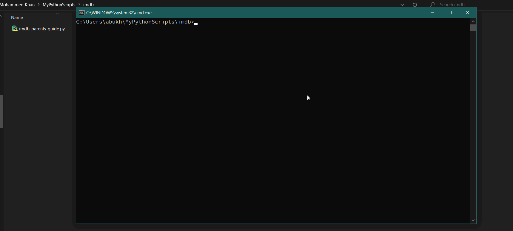

  # IMDb Movie Information Scraper
A python web scraping script that takes in a movie name as input and outputs various information about the movie.

# Features include:
- Show tomatometer rating, audience scores and critics census from rottentomatoes.com
- Shows metascore and movie summary taken from IMDb.
- Shows sex & nudity information from the movie's parents guide page.
- Offers to google the movie name for you, in case not much information is found.

 # Installation
```
pip install beautifulsoup4
pip install lxml
pip install requests
```

# Screenshots
### Initial input

### General search result

### Search result in case not enough information is found


# Walkthrough



GIF created with [LiceCap](http://www.cockos.com/licecap/).


 # How the script works
 This script uses the beautifulsoup4 and the requests module to scrape the IMDB website for the information. The script first gets the movie's reference code from the IMDB search page and uses that to find the movie's main page and the parents guide page. As the script only considers the first result from the search page, **it is recommended that you type in the movie name as accurately you can**.
 
 # My motive for this script
Whenever I watch a movie with my relatives/family I often end up looking at the parents guide section in order to decide whether or not to watch the movie with them. It is really tiresome to first find the movie then scrolldown to find the parents guide section. So, I ended up making this script to gather all the information I need.
